# Дашборд анализа продаж Adventure Works 

Для создания дашборда был использован стандартный образец данных для Microsoft SQL Server [`Anventure Works 2014 DW`](https://learn.microsoft.com/ru-ru/sql/samples/adventureworks-install-configure?view=sql-server-ver16&tabs=ssms).  
Отчет позволяет проанализировать основные коммерческие показатели компании: **выручку**, **валовую прибыль**, **маржинальность**, **чистую прибыль**, **рентабельность**, в разрезах каналов сбыта, географии продаж, типа магазинов, продукции.

Также, дополнительно, в отчете есть функционал клиентского анализа, система рейтинга магазинов и KPI для сотрудников сбыта.  

Основаная механика проведения анализа показателей в динамике – YoY (год к году), что было обусловлено структурой продаж компании. 

## Содержание


- [Дашборд анализа продаж Adventure Works](#дашборд-анализа-продаж-adventure-works)
  - [Содержание](#содержание)
  - [Сводка](#сводка)
  - [Пользовательские сценарии](#пользовательские-сценарии)
    - [1. Анализ продаж E-com](#1-анализ-продаж-e-com)
    - [2. Анализ покупателей E-com](#2-анализ-покупателей-e-com)
    - [3. Анализ продаж реселлеров](#3-анализ-продаж-реселлеров)
  - [Технические особенности](#технические-особенности)
    - [Получение данных](#получение-данных)
    - [Структура модели](#структура-модели)
    - [Закладки и параметры](#закладки-и-параметры)
    - [SVG-элементы](#svg-элементы)
  - [Дизайн и визуальные решения](#дизайн-и-визуальные-решения)

## Сводка
**Отчет:** [`Anventure Works.pbix`](./Adventure%20Works.pbix)   
**Датасет:** [`AdventureWorksDW2014.bak`](./AdventureWorksDW2014.bak)  
**Скилы:** подготовка данных, создание модели данных, концептуализация бизнес-метрик, работа с user story, разработка мер, визуализация данных.  
**Технологии / стек:** T-SQL, Power BI, DAX, SVG, Figma.

## Пользовательские сценарии 

Первая страница отчета Overview служит для обзорного анализа продаж компании: мы можем пройтись по основным коммерческим показателям  
сбыта в обобщенной детализации и выявить какие-то места, на которые точно стоит обратить внимание менеджменту.


Рассмотрим несколько сценариев использования этого отчета:

### 1. Анализ продаж E-com

На первый взгляд, с продажами в канале Internet Sales у компании все впорядке: растет выручка год к году, есть приросты по всей географии продаж и категориям. Однако, если детализировать анализ, в таблице снизу, то можно заметить, что **Рентабельность продаж** (*Profitability, %*) снижается по сравнению с предыдущим годом в нескольких подкатегориях. 

Мы можем сразу перейти в более подробный анализ, воспользовавшись функцией детализации Power BI, детализировав эту подкатегорию на вкладку **Internet Sales**  

Выбрав один из продуктов, на панели **Cost Analysis** мы можем увидеть как увеличились затраты в целом и по статьям за по сравнению с предыдущим годом. Да, цена продажи была также увеличена, но этого оказалось недостаточно, чтобы покрыть затраты. 


### 2. Анализ покупателей E-com

Допустим, нас не устраивает динамика увеличения продаж в Германии и Франции. Мы можем перейтина вкладку Customer Analysis и попытаться проанализировать средний чек наших покупателей.


Мы видим, что только лишь 27,8 % покупателей имеют  ср. чек > 1200, при чем большая часть их 17,6 % приходится на возраст от 40 лет. 
 
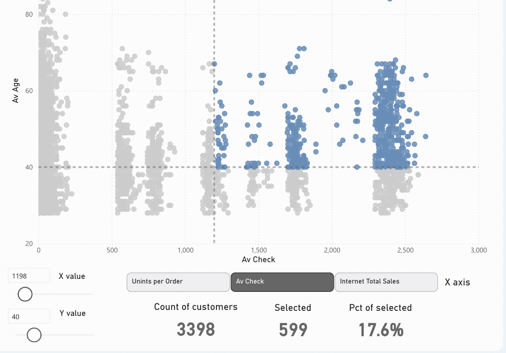

 При чем, только 7,7% из всей выборки имеют ср. чек 1200$ и имею доход от 50К$.
 
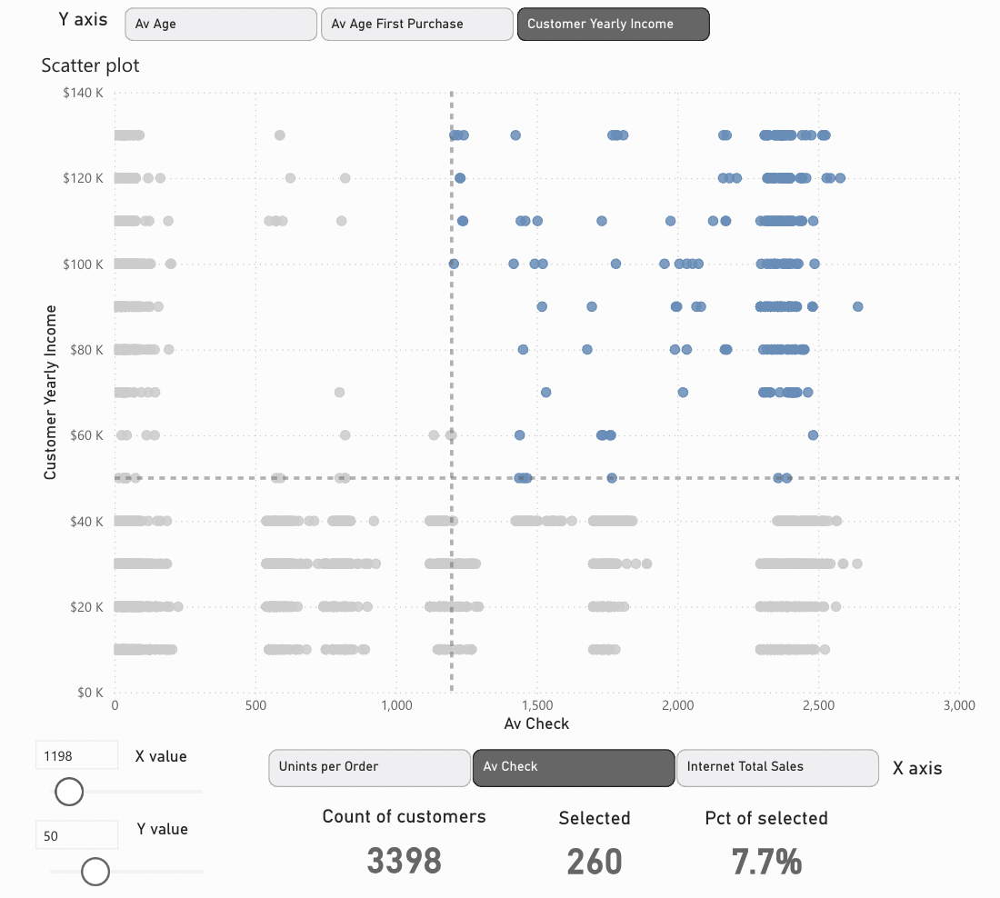

Проанализировав занятость, можно увидеть также, что наименьший процент большого ср. чека у занятых ручным трудом (*Manual*).

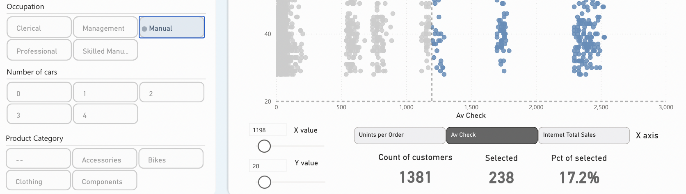

Эта информация может дать аналитикам и менеджерам подсказки, в какую сторону лучше развивать ассортимент, на какие группы покупателей целиться с тем или иным товаром, как построить эффективную маркетинговую кампанию.

### 3. Анализ продаж реселлеров

Уже на первой странице Overview мы видим, что у компании большие проблемы с дистрибьюторским каналом продаж в некоторых товарных подкатегориях: а именно, в Road Bikes, Mountain Bikes, Road Frames.

Стоит уделить внимание именно категории Bikes как самой массовой категории и проанализировать падение в ней. Для этого переходим на вкладку **Reseller Sales** и выбираем категорию Bikes.


Выбрав подкатегорию Road Bikes с самой большой дельтой, мы видим, что динамика продаж совсем не укладывается в прогноз, даже с учетом 15% погрешности. 

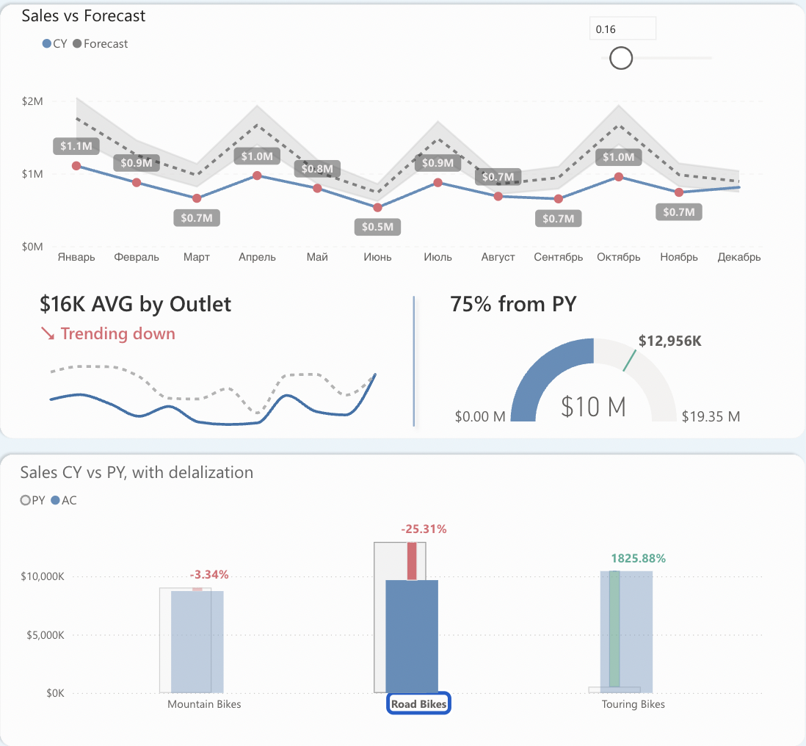

Воспользуемся Drillthrough на страницу Product Details, чтобы рассмотреть ситуацию с этой продукцией более детально. 


На этой странице мы уже можем углубиться до продукта, узнать конкретно его динамику в разрезе географии, типа магазина. Справа есть таблица с YoY-динамикой по магазинам, при нажатии на который, слева вверху отобразится ответсвенный за территорию с контактами, что очень удобно для адресной работы c магазинами и территориями.


## Технические особенности 

### Получение данных

В дашборде используется тип подключения Импорт, данные забираются из локального экземпляра SQL Server. 

### Структура модели

Модель данных организована по смешанной схеме "Снежинка + Звезда", с таблицами фактов и измерениями (справочниками), некоторые из которых являются иерархически подчиненными. 

<pre>Звезда:
  Product 1 --> * InternetSales 
</pre>

<pre>Снежинка:
  Geography 1 --> * Reseller 1 --> * FactResellerSales
</pre>

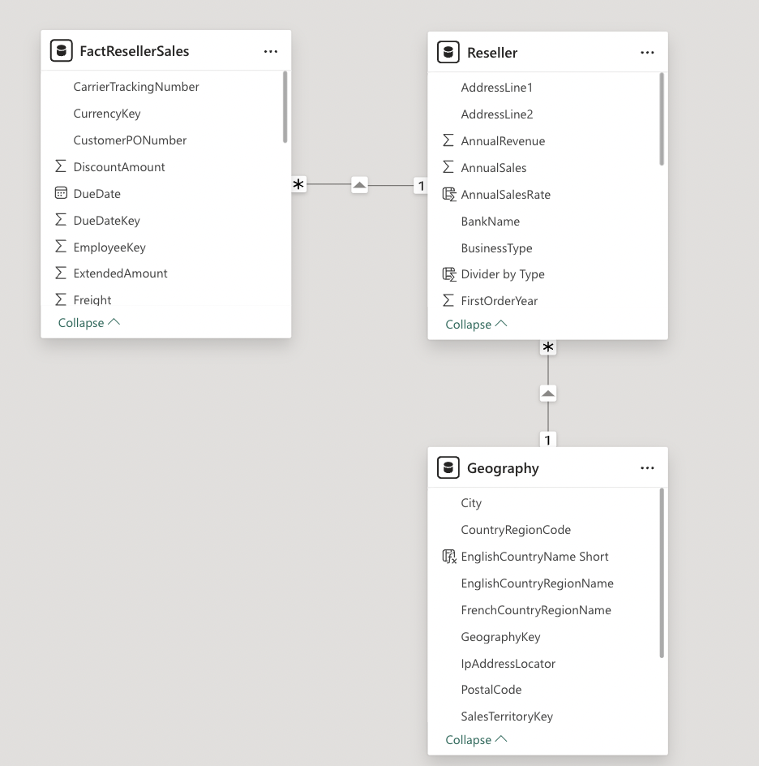

Также используется и более сложная схема с двунаправленными связями, когда необходимо сделать более гибкую кросс-фильтрацию.  
Схема ниже позволяет нам фильтровать продажи по причине продаж, при этом причины продаж оказываются связаны со всеми таблицами-справочниками, с которыми связана основная таблица фактов InternetSales.

<pre>
  SalesReason 1 --> * FactInternetSalesReason * <--> 1 InternetSales 
  DimDate 1 <--> * InternetSales 1 <--> * FactInternetSalesReason
</pre>

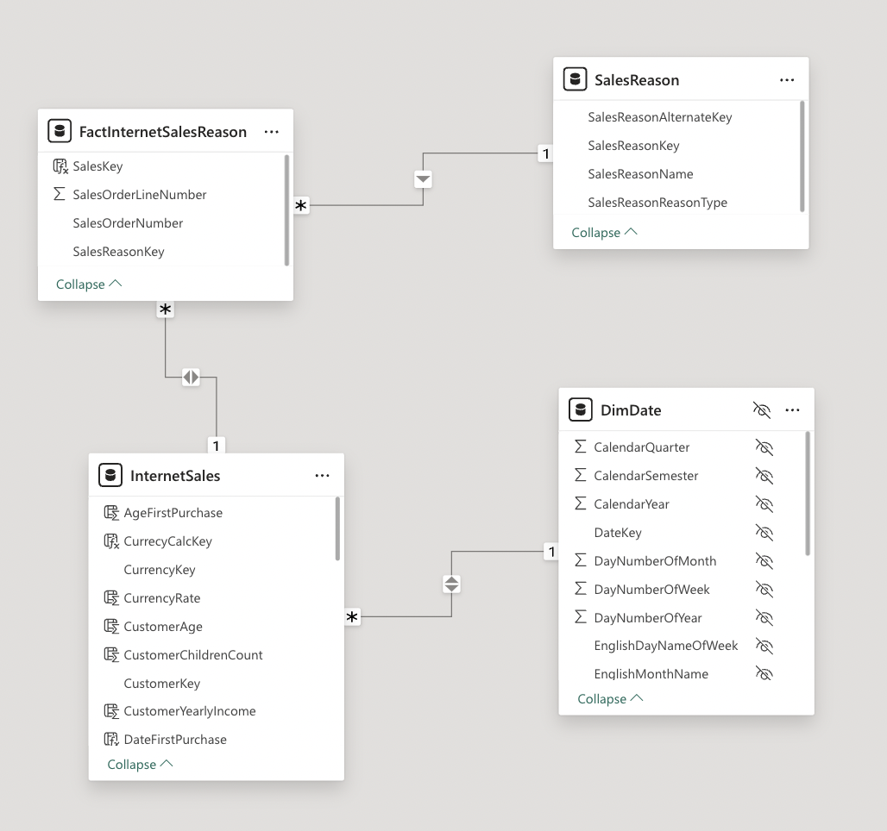

С полной диаграмой табличной модели можно ознакомится [`здесь`](https://app.powerbi.com/groups/me/reports/59faab82-03cf-4150-8af8-0a18464227b4/ReportSection5694034e9a0030d48896?experience=power-bi), перейдя в режим `view semantic model`

---
Меры в модели организованы иерархично, разложены по папкам, находясь логически в одной таблице.

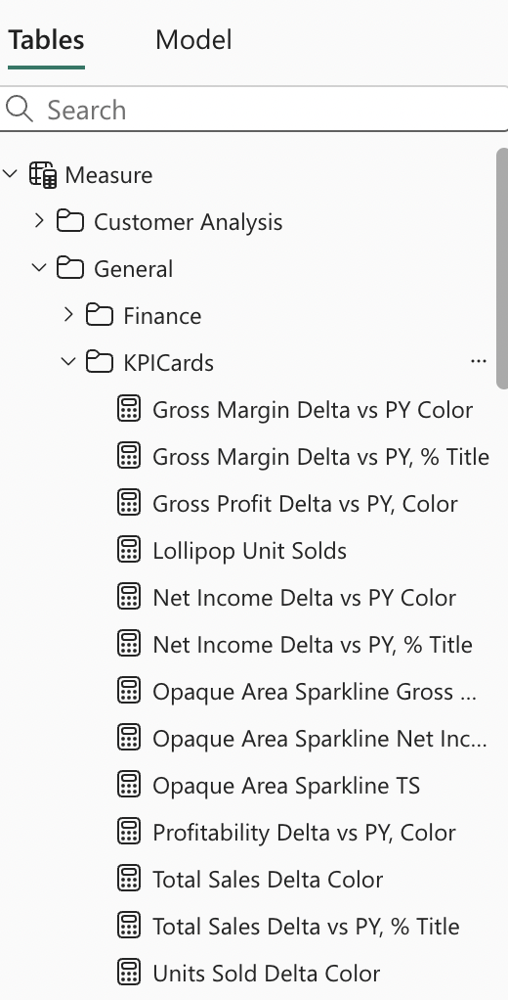

### Закладки и параметры

Чтобы сделать опыт использования отчета более динамичным, в дашборде используются закладки и параметры. 
Первые используются в случаях, когда мы полностью меняем логику визуального элемента, меняем категории анализа, а не только меры.


Однако если изменяются только меры, можно воспользоваться созданием параметров, которые будут содержать значения мер и передавать их в визуальный элемент.  

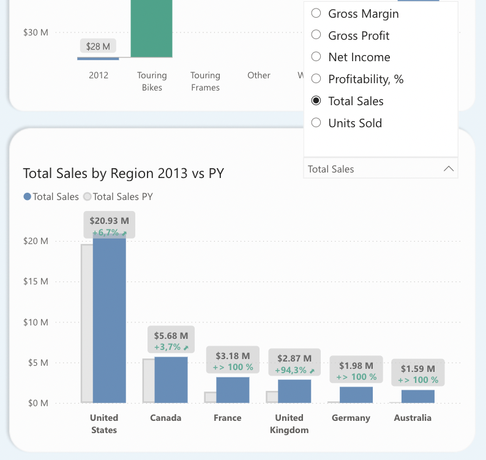

Срез влияет на доступное значение в поле `Overview Barchart`, таким образом меняя отображаемую метрику в визуальном элементе.

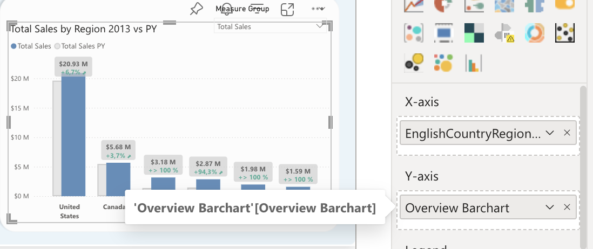

Сам параметр создавался следующим образом:

``` javascript
Overview Barchart = {
    ("Total Sales", NAMEOF('Measure'[Total Sales]), 0, "Total Sales", 1, 1),
    ("Total Sales PY", NAMEOF('Measure'[Total Sales PY]), 1, "Total Sales",1, 2 ),
    ("Units Sold", NAMEOF('Measure'[Units Sold]), 2, "Units Sold", 2, 1),
    ("Units Sold PY", NAMEOF('Measure'[Units Sold PY]), 3, "Units Sold", 2, 2),
    ("Gross Profit", NAMEOF('Measure'[Gross Profit]), 4, "Gross Profit", 3, 1),
    ("Gross Profit PY", NAMEOF('Measure'[Gross Profit PY]), 5, "Gross Profit", 3, 2),
    ("Gross Margin", NAMEOF('Measure'[Gross Margin]), 6, "Gross Margin", 4, 1),
    ("Gross Margin PY", NAMEOF('Measure'[Gross Margin PY]), 7, "Gross Margin", 4, 2),
    ("Profitability, %", NAMEOF('Measure'[Profitability, %]), 8, "Profitability, %", 5, 1),
    ("Profitability PY, %", NAMEOF('Measure'[Profitability PY, %]), 9, "Profitability, %", 5, 2),
    ("Net Income", NAMEOF('Measure'[Net Income]), 10, "Net Income", 6, 1),
    ("Net Income PY", NAMEOF('Measure'[Net Income PY]), 11, "Net Income", 6, 2)
}
```
### SVG-элементы

В отчете довольно много визуальных элементов, в которых использовались svg-изображения в качестве дополнительной визуализации аналитики: графики, маркеры, шкалы выполнения. 

Большинство из них были взяты с [`kerrykolosko.com`](https://kerrykolosko.com/portfolio-category/svg-templates/) и были адаптированы под мой отчет. 

Но один из svg-элементов был создан с нуля, с помощью Figma, и внедрен в отчет. Подробнее об этом, я написал [`здесь`](/bi_development/svg_templates/perfomance_bar/readme.md)

## Дизайн и визуальные решения

Фоновая подложка для отчета создавалась в Figma. Для выделения блоков использовались прямоугольники со скругленным углом 20 и голубая подложка.

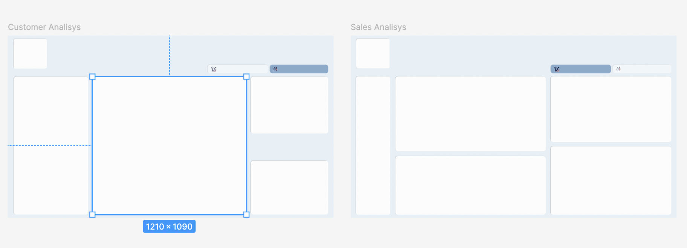

Краткая сводка по используемым цветам и шрифтам:

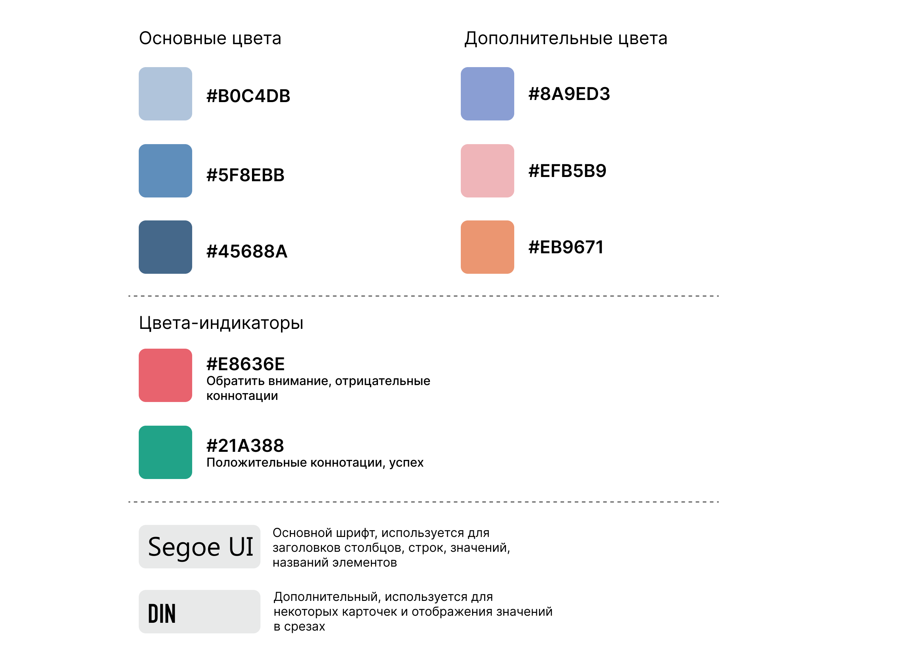