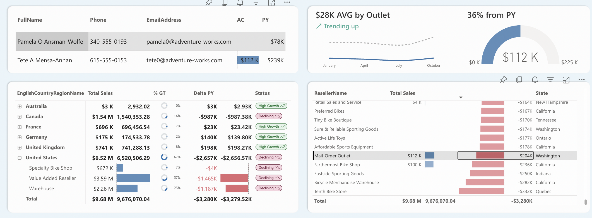

# Дашборд анализа продаж Adventure Works 

Для создания дашборда был использован стандартный образец данных для Microsoft SQL Server [`Anventure Works 2014 DW`](https://learn.microsoft.com/ru-ru/sql/samples/adventureworks-install-configure?view=sql-server-ver16&tabs=ssms).  
Отчет позволяет проанализировать основные коммерческие показатели компании: **выручку**, **валовую прибыль**, **маржинальность**, **чистую прибыль**, **рентабельность**, в разрезах каналов сбыта, географии продаж, типа магазинов, продукции.

Также, дополнительно, в отчете есть функционал клиентского анализа, система рейтинга магазинов и KPI для сотрудников сбыта.  

Основаная механика проведения анализа показателей в динамике – YoY (год к году), что было обусловлено структурой продаж компании. 

## Сводка
**Отчет:** [`Anventure Works.pbix`](./Adventure%20Works.pbix)   
**Датасет:** [`AdventureWorksDW2014.bak`](./AdventureWorksDW2014.bak)  
**Скилы:** подготовка данных, создание модели данных, концептуализация бизнес-метрик, работа с user story, разработка мер, визуализация данных.  
**Технологии / стек:** T-SQL, Power BI, DAX, SVG, Figma.

## Пользовательские сценарии 

Первая страница отчета Overview служит для обзорного анализа продаж компании: мы можем пройтись по основным коммерческим показателям  
сбыта в обобщенной детализации и выявить какие-то места, на которые точно стоит обратить внимание менеджменту.

Рассмотрим несколько сценариев использования этого отчета:

### 1. Анализ продаж E-com

На первый взгляд, с продажами в канале Internet Sales у компании все впорядке: растет выручка год к году, есть приросты по всей географии продаж и категориям. Однако, если детализировать анализ, в таблице снизу, то можно заметить, что **Рентабельность продаж** (*Profitability, %*) снижается по сравнению с предыдущим годом в нескольких подкатегориях. 

Мы можем сразу перейти в более подробный анализ, воспользовавшись функцией детализации Power BI, детализировав эту подкатегорию на вкладку **Internet Sales**  
Выбрав один из продуктов, на панели **Cost Analysis** мы можем увидеть как увеличились затраты в целом и по статьям за по сравнению с предыдущим годом. Да, цена продажи была также увеличена, но этого оказалось недостаточно, чтобы покрыть затраты. 

### 2. Анализ покупателей E-com

Допустим, нас не устраивает динамика увеличения продаж в Германии и Франции. Мы можем перейтина вкладку Customer Analysis и попытаться проанализировать средний чек наших покупателей.

Мы видим, что только лишь 27,8 % покупателей имеют  ср. чек > 1200, при чем большая часть их 17,6 % приходится на возраст от 40 лет. 
 

 При чем, только 7,7% из всей выборки имеют ср. чек 1200$ и имею доход от 50К$.
 

Проанализировав занятость, можно увидеть также, что наименьший процент большого ср. чека у занятых ручным трудом (*Manual*).

Эта информация может дать аналитикам и менеджерам подсказки, в какую сторону лучше развивать ассортимент, на какие группы покупателей целиться с тем или иным товаром, как построить эффективную маркетинговую компанию.

### 3. Анализ продаж реселлеров

Уже на первой странице Overview мы видим, что у компании большие проблемы с дистрибьюторским каналом продаж в некоторых товарных подкатегориях: а именно, в Road Bikes, Mountain Bikes, Road Frames.

Стоит уделить внимание именно категории Bikes как самой массовой категории и проанализировать падение в ней. Для этого переходим на вкладку **Reseller Sales** и выбираем категорию Bikes.

Выбрав подкатегорию Road Bikes с самой большой дельтой, мы видим, что динамика продаж совсем не укладывается в прогноз, даже с учетом 15% погрешности. 

Воспользуемся Drillthrough на страницу Product Details, чтобы рассмотреть ситуацию с этой продукцией более детально. 

На этой странице мы уже можем углубиться до продукта, узнать конкретно его динамику в разрезе географии, типа магазина. Справа есть таблица с YoY-динамикой по магазинам, при нажатии на который, слева вверху отобразится ответсвенный за территорию с контактами, что очень удобно для адресной работы c магазинами и территориями.

