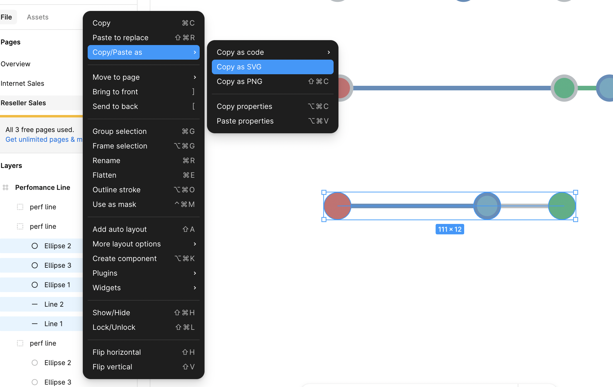
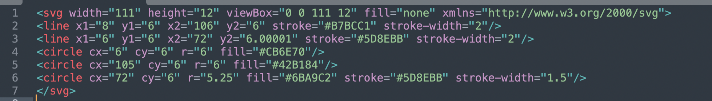
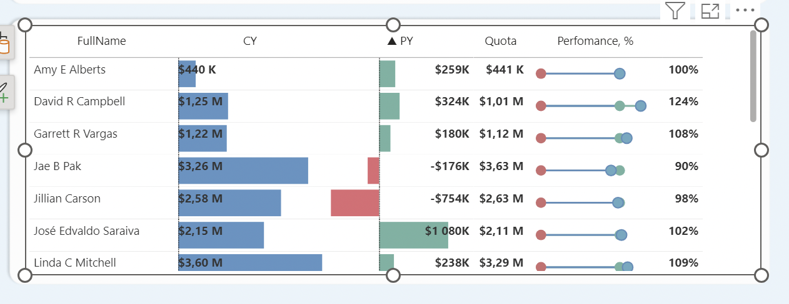

# Создание SVG-элемента Perfomance Line в Power BI
В Power BI можно использовать svg-изображения в карточках и матрицах, что может быть полезно в случае, когда  
не хватает стандартных возможностей условного форматирования ячеек или карточек.  

В нашем случае нам необходимо визуально отобразить процент выполнения плана сотрудниками продаж.  
При этом мы хотим, чтобы на линии была видна цель, а также насколько сотрудник далеко от цели или насколько он её перевыполнил.

## Создание SVG-макета в Figma

Первым делом, необходимо создать примерный макет нашей линии выполнения в Figma и выгрузить его. На этом этапе необходимо продумать как будет изменяться наше svg-изображение в разных контекстах и расположить слои нужным образом.

Затем необходимо скопировать svg-код наших фигур, выделив нужные слои:



## Анализ SVG и создание меры 

После скачивания кода нужно проанализировать какие его части будут изменяться в разных контекстах отчета.  



В нашем случае изменяться будут положения элементов и их цвета. У нас несколько простых фигур с тегами <"lines"> и <"circle">,  
в них нужно изменять переменные оси x и цвета stroke для некоторых элементов. 

В итоге получается довольно длинная мера, но из-за того, что код разбит по модулям, читать его гораздо легче.

```javascript
RS Total Sales Perfomance SVG = 
VAR Perfomace = ROUND([Quota Perfomance, %] * 100, 0)
VAR _LimitedPerfomance = MIN(Perfomace, 140)
VAR _SvgWidth = 150
VAR _SvgHeight = 30
VAR _MainAxisDefault = 100
VAR _MainAxisMax = 140
VAR _PerfomanceAxisWidth = MIN(Perfomace, 100)
VAR _PerfomanceCircleWidth = _LimitedPerfomance
VAR _MainAxisWidth = IF(Perfomace > 100, _LimitedPerfomance, _MainAxisDefault)
VAR _MainAxisColor = IF(Perfomace > 100, "#74B2A2", "#B7BCC1")

VAR _SvgPrefix = "data:image/svg+xml;utf8, " 
VAR _SvgSuffix = "</svg>"

VAR _Background = "<svg width=""" & _SvgWidth & """ height=""" & _SvgHeight & """ viewBox=""0 0 150 30"" fill=""none"" xmlns=""http://www.w3.org/2000/svg"">"
VAR _Main_Axis = "<line x1=""10"" y1=""15"" x2=""" & _MainAxisWidth & """ y2=""15"" stroke=""" & _MainAxisColor & """ stroke-width=""2""/>"
VAR _Perfomance_Axis =  "<line x1=""10"" y1=""15"" x2=""" & _PerfomanceAxisWidth & """ y2=""15"" stroke=""#5D8EBB"" stroke-width=""2""/>"
VAR _ZeroCircle = "<circle cx=""10"" cy=""15"" r=""6"" fill=""#CB6E70""/>"
VAR _TargetCircle = "<circle cx=""" & _MainAxisDefault & """ cy=""15"" r=""6"" fill=""#74B2A2""/>"
VAR _PerfomanceCircle = "<circle cx=""" & _PerfomanceCircleWidth & """ cy=""15"" r=""6"" fill=""#6BA9C2"" stroke=""#5D8EBB"" stroke-width=""1.5""/>"

VAR _Svg = _SvgPrefix & _Background & _Main_Axis & _Perfomance_Axis & _ZeroCircle & _TargetCircle & _PerfomanceCircle & _SvgSuffix
RETURN
    IF( NOT ISBLANK([Reseller TS by Emp]), _Svg, BLANK())
```

### Важные моменты при создании меры

1. Небходимо использовать префикс "data:image/svg+xml;utf8, " для того, чтобы Power BI понял, что мера возвращает svg-изображение
2. DAX-переменные нужно экранировать тройными двойными кавычками """ с обоих сторон 
3. После создания меры нужно сменить категорию данных, которую возвращает мера на Image-URL

## Отображение в отчете

После создания меры, если всё было сделано верно, необхоидмо вытащить меру в одну из ячеек матрицы / таблицы и всё должно работать.



Для тестирования при изменении svg-кода, можно пользоваться сайтами с онлайн-рендерингом вводимого кода, например: [editsvgcode.com](https://editsvgcode.com/)
